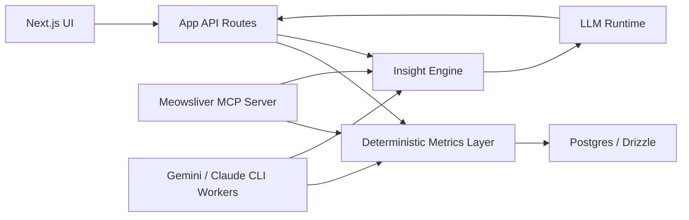

# Meowsliver AI Intelligence Program

## Purpose

This document is the master plan for evolving Meowsliver from a transaction-driven dashboard into an analytics-first personal finance platform with an AI interpretation layer.

The target outcome is not "add chat to a dashboard."

The target outcome is:

- a trustworthy finance operating system for a high-agency individual user
- a platform that can explain what changed, why it matters, and what to do next
- a foundation that can later expose the same financial intelligence through web UI, MCP clients, plugins, and reusable skills

## Current State Snapshot

### What already exists in the repository

| Area | Current state | Notes |
|---|---|---|
| Transaction storage | Working | `transactions` table in Postgres + Drizzle |
| Import pipeline | Working | Preview, duplicate detection, conflict review, commit |
| Account model | Working but partial | Real account records exist, balances are still partly hybrid and opening balances remain implicit |
| Savings goals | Working | DB-backed goals and movement history |
| Dashboard | Working | Cashflow-centric, based on imported transactions plus account/savings APIs |
| Transaction explorer | Working | Filters, search, CRUD for manual transactions |
| Reports | Working | Yearly and monthly analytics with breakdowns |
| Investments | Partial | Strong UI shell, not yet backed by a real holdings model |
| Assets / liabilities | Partial | Derived mostly from `accounts`, not a full balance-sheet ledger |
| AI layer | Missing | No AI orchestration, no context builder, no insight engine |
| Semantic metrics API | Missing | Analytics mostly live in page-local helpers and Zustand getters |
| Multi-user / auth | Missing | Important later, not required for local-first AI MVP |

### Core reality

Meowsliver is already strong at:

- importing real transaction data
- de-duplicating and reviewing it safely
- deriving deterministic cashflow analytics
- showing goal progress and account explainability

Meowsliver is not yet strong at:

- semantic querying of financial history
- anomaly explanation
- forecasting and planning guidance
- portfolio-level asset / liability modeling
- reusable analytics APIs for AI and non-AI consumers

## Strategic Recommendation

### Recommended architecture path

1. Build a deterministic metrics and insight layer first.
2. Add LM Studio as the primary local inference runtime for in-app AI.
3. Use Gemini CLI / Claude Code CLI as optional sidecars for batch reports and deep offline analysis, not as the hot path for every page render.
4. Build Meowsliver MCP tools only after the metrics layer is stable, so external AI clients receive trustworthy, structured data instead of raw database access.

### Why this sequence is the right one

| Decision | Why it matters |
|---|---|
| Deterministic analytics before chat | Prevents hallucinated numbers and keeps the app finance-grade |
| LM Studio before CLI runtime embedding | Better latency control, simpler server integration, lower orchestration risk |
| CLI sidecar instead of page-runtime dependency | Good for long-form analysis and batch jobs, weak for synchronous UI cards |
| MCP after metrics APIs exist | External AI tools should consume curated financial tools, not raw schema details |

## Architecture Principles

### Non-negotiables

- Numbers come from code or SQL, not from the model.
- The model interprets metrics, not raw transactional truth by default.
- Every AI response must carry evidence.
- Every page-level insight must be explainable in plain Thai.
- User-facing finance claims must be reproducible from current persisted data.
- Long-term financial planning features must eventually unify transactions, accounts, goals, liabilities, and investments in one semantic layer.

### Product principles

- AI should reduce cognitive load, not create more dashboards to inspect.
- The user should be able to understand both "what happened" and "what to do next."
- Insights should be proactive on pages, with chat as a secondary exploration surface.
- The app should feel like a private personal CFO system, not a generic BI tool.

## Delivery Options Comparison

| Option | Best use | Strengths | Weaknesses | Recommendation |
|---|---|---|---|---|
| Meowsliver + LM Studio | In-app chat, page insights, private local inference | Local, controllable, OpenAI-compatible API, no incremental API spend | Model quality depends on local hardware and selected model | Primary runtime path |
| Meowsliver + Gemini CLI / Claude Code CLI | Batch jobs, overnight analysis, long-form reports, offline copilots | Can leverage existing auth/subscription posture, strong agentic behavior, useful for deep prompts | Harder to control as a synchronous web runtime, process orchestration is brittle | Secondary sidecar path |
| Meowsliver MCP + Plugin + Skills | External AI workflows, reusable finance tools across clients | Reusable, composable, future-proof, lets multiple AI clients use the same finance brain | Requires a stable semantics layer and permission model first | Phase 2 platform path |

## Proposed Target Stack

## Program Structure

### Workstream A: Metrics Foundation

Objective:
Create stable APIs and libraries for cashflow, anomalies, goal health, account health, import quality, and life-planning metrics.

### Workstream B: In-App AI Runtime

Objective:
Use LM Studio through server routes for chat and page-level insights.

### Workstream C: Batch and Research Agents

Objective:
Use CLI-based tools to generate richer reports, executive summaries, and deep analyses asynchronously.

### Workstream D: MCP / Plugin / Skills Platform

Objective:
Expose Meowsliver's financial intelligence to Codex, Claude Code, Gemini CLI, and future agent clients using structured tools and reusable instructions.

### Workstream E: Financial Model Expansion

Objective:
Upgrade Meowsliver from transaction analytics into a fuller personal finance operating model across assets, liabilities, investments, goals, and upcoming life events.

## Execution Roadmap

## Phase 1: Analytics Backbone

### Goals

- Extract page analytics out of UI components into reusable server-side services
- Create a canonical metrics contract for dashboard, transactions, reports, accounts, and goals
- Add anomaly detection and evidence generation

### Deliverables

- `src/lib/metrics/`
- `src/lib/insights/`
- `src/app/api/metrics/*`
- `src/app/api/insights/*`
- typed response schemas
- benchmark fixtures for key queries

### Exit criteria

- The app can answer core questions without any LLM
- The same metrics feed both charts and AI context

## Phase 2: LM Studio Runtime Integration

### Goals

- Provide `chat with my data` inside the web app
- Add page-level AI insight cards
- Keep responses evidence-backed and local-first

### Deliverables

- `/api/ai/chat`
- `/api/ai/insights/dashboard`
- `/api/ai/insights/transactions`
- `/api/ai/insights/reports`
- `/api/ai/insights/accounts`
- `/api/ai/insights/goals`

### Exit criteria

- Chat and insight cards are live locally
- Model outputs do not invent numbers
- Performance is acceptable on the target machine

## Phase 3: CLI Sidecar Intelligence

### Goals

- Support longer-running analysis workflows
- Generate rich weekly/monthly reports
- Produce strategic planning narratives outside page render cycles

### Deliverables

- provider adapters for Gemini CLI and Claude Code CLI
- background job runner
- report generation templates
- audit trail for prompts and outputs

### Exit criteria

- Long-form report generation works reliably without blocking the app UI

## Phase 4: MCP Platform

### Goals

- Expose trusted finance tools to external AI clients
- Standardize data access and write approvals
- Enable reusable skills and plugins for advisor workflows

### Deliverables

- `meowsliver` MCP server
- read-only finance tools
- approval-based write tools
- plugin metadata and skills docs

### Exit criteria

- Codex, Claude Code, and Gemini CLI can query Meowsliver safely through tools

## Phase 5: Personal CFO Platform

### Goals

- Move beyond descriptive analytics toward planning, forecasting, and guidance
- Support life events such as marriage, emergency fund design, career changes, and investment allocation

### Deliverables

- scenario engine
- plan tracking
- liability timelines
- asset snapshot ingestion
- recommendation engine tied to explicit goals

### Exit criteria

- The app can explain current state, projected state, and concrete next steps

## Shared Risks

### Technical risks

- The current analytics logic is spread across page components and Zustand getters, which can slow server-side reuse.
- Local models may not handle Thai financial reasoning well enough without careful prompt design and strong metric scaffolding.
- CLI tools may be usable interactively but not ideal as embedded request/response engines.

### Product risks

- If AI appears before deterministic metrics are mature, user trust will drop quickly.
- If asset and investment data remain partial, users may over-trust incomplete advice.
- If insights are generic, the product will feel like "chat on top of charts" rather than a meaningful finance platform.

### Governance risks

- Logs may accidentally contain sensitive financial information.
- Future write tools need approval boundaries.
- Once multi-user support arrives, tenant isolation becomes mandatory for AI context assembly.

## Immediate Next Actions

1. Build the metrics and insight service layer before adding any model call to the critical path.
2. Implement the LM Studio path first because it is the cleanest fit for local web-app AI.
3. Add CLI-based agents only for asynchronous or non-UI-critical workflows.
4. Treat MCP as a product surface, not just an engineering toy.
5. Expand the financial model so the system can eventually support full personal finance planning, not only transaction analysis.

## Document Map

| Document | Purpose |
|---|---|
| `01-meowsliver-lm-studio-plan.md` | Detailed implementation plan for the local inference path |
| `02-meowsliver-cli-agents-plan.md` | Detailed plan for Gemini CLI / Claude Code CLI orchestration |
| `03-meowsliver-mcp-plugin-skills-plan.md` | Platform plan for MCP tools, plugins, and skills |
| `04-product-intelligence-and-metrics-plan.md` | Feature, metrics, dashboard, and DB-derived insight roadmap |
| `05-gap-analysis-and-strategic-report.md` | Strategic report on what is still missing for a real personal CFO platform |
