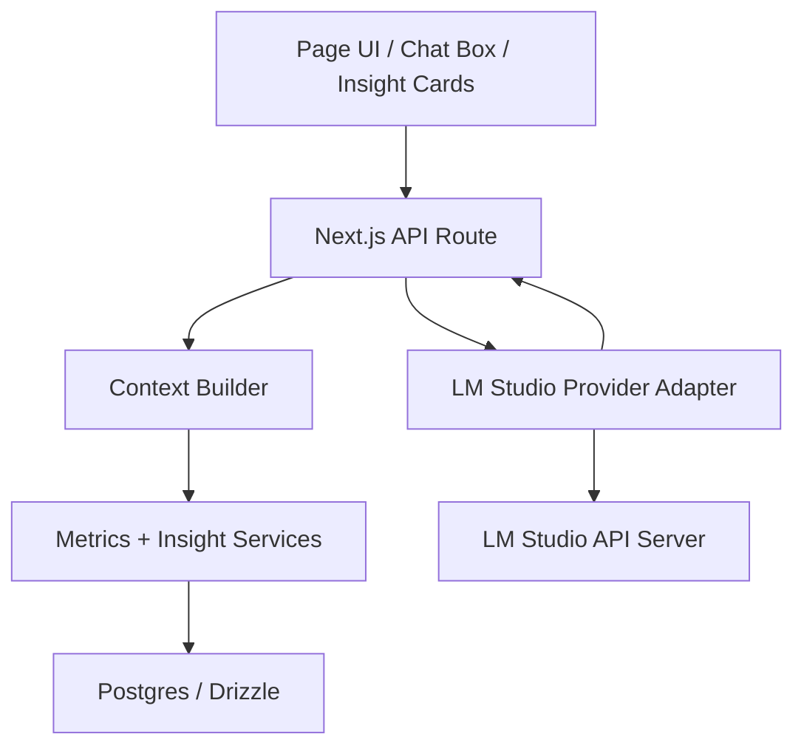

# Meowsliver + LM Studio Implementation Plan

## Objective

Use LM Studio as the primary local inference runtime for AI features inside Meowsliver without adding recurring API cost.

This path is the best fit for:

- chat with personal finance data inside the localhost app
- proactive insight cards on dashboard, transactions, reports, accounts, and goals pages
- private local inference where financial data should stay on the machine

## Why LM Studio is the recommended primary path

### Highlights

- OpenAI-compatible local API interface
- Works cleanly with Next.js server routes
- Keeps sensitive financial data on the same machine
- Easier to control than spawning interactive CLIs for every web request

### Key Takeaways

- LM Studio should sit behind Next.js server routes, not be called directly from browser UI by default.
- The LLM should receive curated metrics, anomaly summaries, and evidence bundles, not the full raw transaction table on every request.
- The local model is responsible for explanation and synthesis, not authoritative number crunching.

### Risks

- Model quality varies materially by hardware and chosen local model.
- Thai-language explanation quality may be uneven without prompt tuning and benchmarks.
- Large 5-year datasets can blow up latency if context is not aggressively summarized.

### Next Actions

1. Introduce a deterministic metrics layer first.
2. Add a provider adapter for LM Studio.
3. Ship dashboard chat and insight cards as the first live UX.

## External Runtime Notes

The current official LM Studio docs indicate:

- LM Studio can run a local API server on `localhost` or the local network.
- It exposes OpenAI-compatible and Anthropic-compatible endpoints.
- Authentication, local-network serving, and CORS are configurable server settings.

Reference links:

- [LM Studio Local Server](https://lmstudio.ai/docs/developer/core/server)
- [REST Quickstart](https://lmstudio.ai/docs/developer/rest/quickstart)
- [Server Settings](https://lmstudio.ai/docs/developer/core/server/settings)
- [Serve on Local Network](https://lmstudio.ai/docs/developer/core/server/serve-on-network)

## Recommended Architecture



## Principle of Operation

### Deterministic first

The server computes:

- totals
- baselines
- ranks
- anomaly scores
- top categories
- top merchants / recipients
- account drift
- goal progress risk

The model then explains:

- what changed
- how unusual it is
- what drove the change
- what the user should review next

## Scope of AI Features

### Phase 1 features

| Feature | Surface | Response type |
|---|---|---|
| Ask Meowsliver chat | Dashboard | Conversational answer with evidence |
| Today anomaly card | Dashboard | One-paragraph insight |
| Spending spike summary | Transactions | One-paragraph insight with drivers |
| Monthly narrative | Reports | Executive summary |
| Goal-at-risk summary | Buckets / goal detail | Short advisory insight |

### Later-phase features

| Feature | Why it matters |
|---|---|
| Follow-up question suggestions | Reduces user prompt burden |
| Explain this transaction | Creates row-level drill-down intelligence |
| Compare periods in plain Thai | Executive-friendly review flow |
| Planning assistant for targets | Bridges analytics to action |
| Forecast completion risk | Makes goals operational, not decorative |

## Recommended Code Structure

### New server-side modules

| Path | Responsibility |
|---|---|
| `src/lib/ai/providers/lm-studio.ts` | Low-level HTTP client for LM Studio |
| `src/lib/ai/provider-types.ts` | Shared provider request/response types |
| `src/lib/ai/prompt-policies.ts` | System prompt and output rules |
| `src/lib/ai/context-builders.ts` | Compact context assembly for each surface |
| `src/lib/ai/chat-router.ts` | Intent routing and tool selection |
| `src/lib/insights/anomaly-detectors.ts` | Deterministic anomaly logic |
| `src/lib/insights/insight-engine.ts` | Convert metrics into structured insight payloads |
| `src/lib/metrics/*` | Shared finance metrics for all surfaces |

### New API routes

| Route | Purpose |
|---|---|
| `src/app/api/ai/chat/route.ts` | Conversational entrypoint |
| `src/app/api/ai/insights/dashboard/route.ts` | Dashboard summary insights |
| `src/app/api/ai/insights/transactions/route.ts` | Transaction anomaly and trend insights |
| `src/app/api/ai/insights/reports/route.ts` | Reporting narrative |
| `src/app/api/ai/insights/accounts/[accountId]/route.ts` | Account health explanation |
| `src/app/api/ai/insights/goals/[goalId]/route.ts` | Goal risk and pace commentary |

## Context Design

### What the model should receive

- page name
- selected period
- a compact set of metrics
- a short evidence bundle
- optional top drivers
- a strict output schema

### What the model should not receive by default

- the entire transaction history
- raw import rows
- full account or goal tables without summarization
- unbounded narrative prompts

## Example Structured Context

```json
{
  "surface": "transactions",
  "period": "2026-04-18",
  "question": "วันนี้ผิดปกติไหม",
  "metrics": {
    "todayExpense": 19240,
    "avgDailyExpense30d": 4180,
    "avgDailyExpense365d": 4012,
    "avgDailyExpense5y": 3895,
    "rankInHistory": 1,
    "zScore": 4.8
  },
  "drivers": {
    "topCategories": [
      { "name": "อาหาร/เครื่องดื่ม", "amount": 8400 },
      { "name": "ช้อปปิ้ง", "amount": 6200 }
    ],
    "topRecipients": [
      { "name": "Merchant A", "amount": 5300 },
      { "name": "Merchant B", "amount": 4200 }
    ]
  },
  "rules": [
    "Do not invent numbers",
    "Use only provided evidence",
    "Respond in Thai",
    "Keep the answer short and specific"
  ]
}
```

## Output Contract

The provider response should be normalized into an internal schema like this:

```ts
type AiEvidence = {
  label: string;
  value: string;
};

type AiInsight = {
  title: string;
  summary: string;
  evidence: AiEvidence[];
  confidence: "low" | "medium" | "high";
  followUpQuestions: string[];
  warnings: string[];
};
```

This avoids page components having to parse free-form prose.

## Prompt Policy

### System prompt requirements

- Always answer in Thai unless the user asks otherwise.
- Treat all provided metrics as the only numeric truth.
- Never invent or infer missing amounts.
- If evidence is insufficient, say so directly.
- Prefer plain, executive-safe wording.
- Separate observation from recommendation.

### Suggested prompt skeleton

```text
คุณคือ personal finance analyst assistant ของ Meowsliver

หน้าที่ของคุณคืออธิบายจาก structured metrics ที่ระบบให้เท่านั้น

ข้อห้าม:
- ห้ามสร้างตัวเลขใหม่
- ห้ามสมมติว่ามีข้อมูลถ้าไม่ได้ให้มา
- ถ้าข้อมูลยังไม่พอให้ตอบตรงๆว่า "ข้อมูลยังไม่พอ"

แนวทางการตอบ:
- ตอบภาษาไทย
- สรุปสั้น กระชับ ชัดเจน
- ระบุว่าผิดปกติหรือไม่
- อธิบาย driver หลัก
- เสนอคำถามหรือ action ถัดไป 1-3 ข้อ
```

## Surface-by-Surface Plan

## Dashboard

### Recommended UX

- `Ask Meowsliver` chat box
- `Today’s AI Insights`
- `What changed this month`
- `What needs attention`

### Metrics required

- current month income / expense / net
- rolling 30-day expense average
- spend acceleration
- top category shifts
- cashflow rank compared to history
- import freshness

## Transactions page

### Recommended UX

- anomaly banner above the table
- AI summary of active filters
- row action: "Explain this transaction"
- "Why is this day/week unusual?"

### Metrics required

- daily totals
- weekly totals
- spend ranks by date
- merchant concentration
- first-seen recipient
- duplicate-like rows
- frequency spikes

## Reports

### Recommended UX

- monthly executive summary
- annual strengths / risks / next actions
- trend interpretation on top of charts

### Metrics required

- month-over-month change
- year-over-year change
- category concentration
- savings rate trend
- best / worst months

## Accounts

### Recommended UX

- account health summary
- drift explanation
- balance confidence indicator

### Metrics required

- stored vs transaction-derived balance
- number of linked transactions
- recency of linked activity
- transfer ratio
- accounts with no reconciliation basis

## Savings goals

### Recommended UX

- goal at risk
- pace needed vs historical contribution pace
- growth contribution vs cash contribution split

### Metrics required

- progress
- remaining amount
- monthly pace needed
- recent average contribution pace
- missed pace count

## Provider Adapter Design

### Responsibilities

- build request payload
- set headers and auth when configured
- stream or non-stream support
- normalize provider output
- timeout and retry
- expose health check

### Environment variables

| Variable | Purpose |
|---|---|
| `LM_STUDIO_BASE_URL` | Usually `http://localhost:1234` |
| `LM_STUDIO_MODEL` | Default model identifier |
| `LM_STUDIO_API_KEY` | Optional if auth is enabled in LM Studio |
| `AI_ENABLE_STREAMING` | Optional toggle for streamed chat UI |
| `AI_LOG_LEVEL` | Logging verbosity |

## Performance Plan

### Latency targets

| Interaction | Target |
|---|---|
| Page insight card | under 2-4 seconds |
| Short chat answer | under 4-8 seconds |
| Long monthly narrative | under 8-15 seconds |

### Performance tactics

- cache deterministic metrics separately from model outputs
- precompute anomaly candidates
- keep prompt context compact
- avoid sending large raw tables
- optionally memoize repeated prompts per period

## Security and Privacy

### Guardrails

- call LM Studio only from server routes by default
- keep browser-side prompts free of direct database credentials
- redact or disable sensitive logging
- expose a toggle for saving prompt/output traces
- keep write actions out of the first version

### If browser-to-LM-Studio direct calls are ever considered

- require explicit justification
- enable auth in LM Studio
- manage CORS carefully
- accept that local-network exposure increases risk

## Testing and Validation

### Required tests

- output schema validation
- prompt regression fixtures
- Thai-language response quality review
- latency benchmarks on the target machine
- evidence completeness checks

### Benchmark pack

Create 30 canonical questions:

- 10 descriptive
- 10 comparative
- 10 anomaly / advisory

Track:

- numeric correctness
- response usefulness
- hallucination rate
- Thai fluency
- response time

## Rollout Plan

## Sprint 1: Infrastructure

- add provider adapter
- add chat route
- add one dashboard insight route
- add health check page or CLI script

## Sprint 2: Deterministic insight engine

- implement anomaly detectors
- implement evidence bundle builder
- support dashboard and transactions routes

## Sprint 3: UI integration

- dashboard chat
- dashboard insight cards
- transaction anomaly banner

## Sprint 4: Reporting and goals

- reports narrative
- goal health insights
- account health insights

## Risks and Mitigations

| Risk | Impact | Mitigation |
|---|---|---|
| Local model gives weak Thai answers | Medium | keep deterministic evidence strong, benchmark multiple models |
| Context gets too large | High | summarize server-side and cap evidence payload size |
| Users over-trust AI text | High | show evidence and confidence, avoid fake precision |
| Integration becomes tightly coupled to one provider | Medium | define a provider interface now |

## Final Recommendation

LM Studio should be the first live AI runtime for Meowsliver because it best aligns with:

- local-first privacy
- controlled server integration
- zero incremental API spend
- future compatibility with structured, evidence-backed finance workflows

The implementation should begin only after the deterministic metrics layer is separated from UI logic and exposed through reusable server-side contracts.
