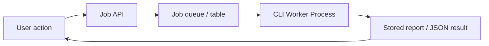
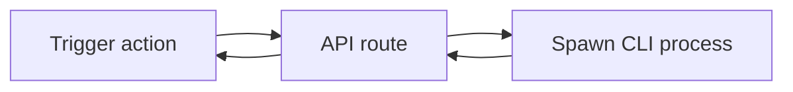

# Meowsliver + Gemini CLI / Claude Code CLI Plan

## Objective

Define the role of Gemini CLI and Claude Code CLI in Meowsliver without turning the web app into a fragile subprocess wrapper.

This plan treats CLI agents as:

- high-value sidecars for long-form analysis
- headless workers for batch reports
- deep reasoning assistants for offline or asynchronous tasks

This plan does not recommend them as the primary runtime for synchronous page insight rendering.

## Executive Position

### Highlights

- CLI agents are strong for deep, longer-running reasoning tasks.
- They are weaker than LM Studio for low-latency page-level UI interactions.
- They become very valuable when used as report generators, planners, reviewers, and overnight analysis workers.

### Key Takeaways

- Use CLI agents outside the hot UI path.
- Give them compact, curated financial snapshots instead of raw unbounded data.
- Capture outputs in structured JSON or markdown templates.
- Maintain a clear boundary between deterministic metrics generation and narrative generation.

### Risks

- Process orchestration is more brittle than an HTTP model server.
- Authentication and session behavior vary by tool.
- Output format stability must be managed explicitly.

### Next Actions

1. Build one generic CLI worker adapter.
2. Start with async report generation.
3. Do not let page render depend on CLI completion.

## External Runtime Notes

### Gemini CLI

Current official materials indicate:

- Gemini CLI supports Google login and headless/scripting workflows.
- It also supports MCP server integration via settings.
- Google-account login is positioned for individuals and Gemini Code Assist users, with documented quota limits in the official README.

Reference links:

- [Gemini CLI official repository](https://github.com/google-gemini/gemini-cli)

### Claude Code

Current official materials indicate:

- Claude Code offers headless mode via `claude -p` for non-interactive use.
- The SDK and headless workflows are documented for automation.
- Official SDK docs describe authentication via Anthropic API or third-party providers such as Bedrock or Vertex.

Reference links:

- [Claude Code SDK overview](https://docs.anthropic.com/en/docs/claude-code/sdk)
- [Claude Code headless mode](https://docs.anthropic.com/s/claude-code-sdk)
- [Claude Code MCP docs](https://docs.anthropic.com/en/docs/claude-code/mcp)

### Practical implication

Based on the official docs, Gemini CLI looks more naturally aligned with low-cost or quota-included individual usage.

Claude Code headless usage appears more formalized through the SDK/API/provider route. If the current subscription posture is only interactive local usage, embedding it behind a web app may still require extra validation on technical and commercial fit. That statement is an implementation inference, not a direct vendor quote.

## Recommended Usage Model

| Use case | Gemini CLI | Claude Code CLI | Recommendation |
|---|---|---|---|
| Synchronous page insight | Possible but awkward | Possible but awkward | Do not use as primary path |
| Background report generation | Strong | Strong | Recommended |
| Deep repository-aware planning | Medium | Strong | Recommended for engineering-facing reports |
| Multi-step research / synthesis | Strong | Strong | Recommended |
| User-facing chat latency | Weak | Weak | Prefer LM Studio |
| MCP-hosted tool orchestration | Strong | Strong | Recommended in later platform phase |

## Best-Fit Meowsliver Scenarios

### Scenario 1: Overnight financial executive report

Prompt the CLI agent with:

- a financial snapshot
- top anomalies
- goal status
- unresolved account drift
- import quality issues

Expected output:

- highlights
- key takeaways
- risks
- next actions

### Scenario 2: Monthly personal CFO memo

Prompt the CLI agent with:

- month summary metrics
- trend deltas
- top spending categories
- unusual events
- goal contribution pace

Expected output:

- concise board-safe narrative
- strategic recommendations
- action checklist

### Scenario 3: Long-form what-if analysis

Prompt the CLI agent with:

- current cashflow
- savings goals
- liabilities
- scenario assumptions

Expected output:

- scenario comparison
- trade-offs
- recommended operating plan

## Not Recommended as Primary Use Cases

- every dashboard load
- every filter change on transactions page
- every row click in a transaction table
- low-latency cards that must render in under a few seconds

## Architecture Options

## Option A: Simple Headless Worker



### Best for

- monthly reports
- strategic memos
- deferred analysis
- exportable markdown artifacts

## Option B: On-demand Subprocess



### Best for

- internal admin tools
- small prototypes

### Weakness

- brittle for mainstream page UX

## Option C: MCP-mediated external intelligence

Use Meowsliver as the data provider and let CLI clients consume it through MCP tools instead of forcing the web app to orchestrate every prompt.

### Best for

- analyst workflows
- power-user assistants
- external agent ecosystems

## Recommended Repository Design

### New modules

| Path | Responsibility |
|---|---|
| `src/lib/ai/providers/cli-base.ts` | Shared process execution helpers |
| `src/lib/ai/providers/gemini-cli.ts` | Gemini CLI adapter |
| `src/lib/ai/providers/claude-code-cli.ts` | Claude Code adapter |
| `src/lib/ai/jobs/report-jobs.ts` | Job definitions and orchestration |
| `src/lib/ai/jobs/job-store.ts` | Job persistence |
| `src/app/api/ai/jobs/*` | Trigger, status, fetch result |

### Suggested job persistence

Add a new DB table later if batch jobs become core:

| Table | Purpose |
|---|---|
| `ai_jobs` | queued/running/completed job metadata |
| `ai_job_runs` | prompt/result/error payloads and audit trail |

For the first pass, a file-based or in-memory approach is acceptable for localhost, but a DB-backed queue is better if reports should persist.

## Provider Contract

```ts
type CliAgentRequest = {
  task: string;
  context: Record<string, unknown>;
  outputFormat: "markdown" | "json";
  timeoutMs: number;
};

type CliAgentResult = {
  status: "completed" | "failed" | "timeout";
  stdout: string;
  stderr?: string;
  parsedJson?: unknown;
  durationMs: number;
};
```

## Process Management Guardrails

### Hard requirements

- explicit timeout
- explicit cwd
- fixed environment allowlist
- stdout/stderr capture
- optional JSON mode or markdown template contract
- retry only on transport/process failure, not on semantic failure

### Operational limits

- one long-running worker at a time for the first release
- concurrency cap to avoid local machine overload
- queue-based UX instead of spinner-based UX for long jobs

## Prompting Strategy

### Input structure

Every CLI task should receive:

- role
- task objective
- structured financial snapshot
- rules
- expected output schema

### Example report request

```json
{
  "role": "personal-finance-strategist",
  "task": "Create a monthly operating review",
  "snapshot": {
    "period": "2026-04",
    "income": 220000,
    "expense": 258000,
    "net": -38000,
    "topExpenseCategories": [
      { "name": "อาหาร/เครื่องดื่ม", "amount": 42000 },
      { "name": "เดินทาง", "amount": 31000 }
    ],
    "goalHealth": [
      { "goal": "Wedding", "progressPercent": 43, "paceRisk": "medium" }
    ]
  },
  "rules": [
    "Do not invent numbers",
    "Separate observations from recommendations",
    "Write in Thai",
    "Output markdown"
  ]
}
```

## Output Templates

### Recommended markdown sections

- Highlights
- Key Takeaways
- Risks
- Next Actions

### Recommended JSON sections

- `summary`
- `observations`
- `risks`
- `actions`
- `confidence`

## Where CLI Agents Add Unique Value

| Capability | Why CLI helps |
|---|---|
| Rich memo writing | Better for longer context and more elaborate reasoning |
| Cross-document synthesis | Can combine metrics snapshots, notes, goals, and roadmap context |
| Overnight workflows | Can run without blocking interactive UX |
| Engineering-facing deep analysis | Claude Code especially can reason over repo context and MCP tools |

## Trade-offs Compared with LM Studio

| Dimension | LM Studio | CLI agents |
|---|---|---|
| UI latency | Better | Worse |
| Local privacy | Good | Good |
| Runtime predictability | Better | Worse |
| Implementation simplicity | Better for in-app chat | Better for async reports |
| Deep agentic work | Medium | Better |
| Structured web integration | Better | Harder |

## Recommended Feature Set

### First-wave CLI features

- Generate monthly review memo
- Generate quarterly personal finance summary
- Generate "what changed" digest after imports
- Generate goal strategy note
- Generate account reconciliation review summary

### Later-wave CLI features

- scenario planning packs
- policy-based recommendation reports
- financial health scorecards
- repository-aware implementation assistant for finance features

## User Experience Pattern

### Good UX

- "Generate strategic summary"
- "Prepare my monthly memo"
- "Run deeper analysis"
- "Create action checklist"

### Bad UX

- "Loading live CLI answer..."
- page blocked waiting for subprocess
- silent failures without stored artifacts

## Risks and Mitigations

| Risk | Impact | Mitigation |
|---|---|---|
| CLI auth/session expires | High | health check command and explicit status panel |
| Output shape changes | High | force JSON mode when available or post-validate output |
| Process hangs | High | hard timeout and job cancellation |
| Tool becomes unavailable | Medium | keep LM Studio path as primary runtime |
| User assumes advice is always complete | High | include evidence and data coverage notes |

## Recommended Rollout

## Sprint 1

- generic CLI runner
- one job type: monthly executive report
- markdown output stored locally or in DB

## Sprint 2

- second job type: import digest
- third job type: goal strategy memo
- add job status UI

## Sprint 3

- add provider abstraction so Gemini CLI and Claude Code CLI can be selected per task
- add JSON-validated result mode where supported

## Final Recommendation

Gemini CLI and Claude Code CLI should be treated as an asynchronous intelligence tier for Meowsliver, not as the primary serving layer for chat inside the app.

That positioning keeps the architecture clean:

- LM Studio handles synchronous local inference for the product
- CLI agents handle richer, slower, higher-value analysis jobs
- the deterministic metrics layer remains the shared source of truth for both
