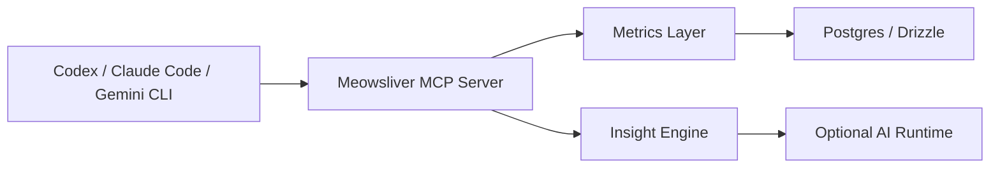

# Meowsliver MCP + Plugin + Skills Plan

## Objective

Turn Meowsliver into a reusable financial intelligence platform that can be queried and orchestrated by external AI clients such as Codex, Claude Code, and Gemini CLI through structured tools instead of raw prompt hacking.

This plan assumes:

- the web app remains the primary product surface
- the MCP layer becomes the reusable machine interface
- plugins and skills become the packaged distribution layer for repeatable advisor workflows

## Why this matters

### Highlights

- MCP turns Meowsliver from an app into a platform.
- External AI tools can query finances safely using curated tools.
- Skills create reusable workflows for planning, review, anomaly analysis, and goal design.

### Key Takeaways

- MCP should expose finance semantics, not raw SQL tables.
- Read-only tools should arrive first.
- Any mutation capability must be approval-gated.
- Skills should encode workflows, not duplicate business logic.

### Risks

- If the MCP layer is built before the metrics layer, external clients will receive weak or inconsistent data.
- Exposing raw DB access through tools would create trust and privacy problems.
- Plugin and skill sprawl can become documentation theater unless each artifact maps to a real user workflow.

### Next Actions

1. Define the finance domain tools first.
2. Build a read-only MCP server on top of deterministic metrics.
3. Add skills for specific high-value workflows.

## Strategic Positioning

### What MCP is for in Meowsliver

MCP should let AI clients do things like:

- ask for a compact summary of spending by period
- compare two periods
- identify unusual behavior
- explain account balance drift
- assess savings goal risk
- generate a planning snapshot for life goals

### What MCP is not for initially

- direct arbitrary SQL execution
- unrestricted file-system access
- silent mutation of financial records
- autonomous commit of imports or account balance changes

## Recommended Architecture



## Proposed Capability Layers

## Layer 1: Deterministic data services

Backed by:

- `src/lib/metrics/*`
- `src/lib/insights/*`
- `src/lib/server/*`

These are the real business logic and should remain the single source of truth.

## Layer 2: MCP server

Backed by:

- `apps/meowsliver-mcp/` or `src/mcp/`

This layer translates stable domain operations into MCP tools and resources.

## Layer 3: Plugin packaging

Backed by:

- `.codex-plugin/plugin.json`
- optional marketplace or local plugin metadata

This layer defines how the MCP server and related assets are discovered by client environments.

## Layer 4: Skills

Backed by:

- `skills/meowsliver-*.md`

This layer teaches the AI how to use the tools well for specific advisor workflows.

## Recommended MCP Tool Set

## Read-only foundation tools

| Tool name | Purpose | Input |
|---|---|---|
| `get_dashboard_summary` | Current period and top-level KPI snapshot | year, month optional |
| `compare_periods` | Compare two periods on income, expense, net, categories | period A, period B |
| `list_spending_anomalies` | Return deterministic anomaly candidates | date range, threshold config |
| `explain_spending_day` | Explain why one day is unusual | date |
| `get_account_health` | Reconciliation and drift summary | accountId |
| `get_goal_health` | Goal progress, pace, risk | goalId |
| `list_goal_risks` | Portfolio-level goal-at-risk summary | optional filters |
| `get_import_run_summary` | Import quality and unresolved issues | importRunId |
| `list_recent_import_issues` | Recent conflict and skip patterns | count / date range |
| `get_monthly_review_packet` | Structured monthly snapshot for reporting | year, month |

## Later read-only tools

| Tool name | Purpose |
|---|---|
| `forecast_goal_completion` | Estimate target completion under scenario assumptions |
| `get_cashflow_volatility` | Show consistency and variability of spend/income |
| `list_recurring_candidates` | Detect recurring expenses and obligations |
| `get_financial_health_snapshot` | Multi-domain health view for executive summary |

## Approval-gated write tools

These should arrive only after governance is clear.

| Tool name | Purpose | Guardrail |
|---|---|---|
| `create_savings_goal` | Create a goal | explicit approval |
| `add_goal_entry` | Add goal movement | explicit approval |
| `create_manual_transaction` | Add a manual row | explicit approval |
| `update_transaction` | Edit manual transaction | explicit approval |
| `review_import_conflict` | Apply review decision | explicit approval |
| `reconcile_account` | Reset account balance from linked transactions | explicit approval |

## Suggested MCP Resources

Resources are useful for compact read access and AI context discovery.

| Resource | Purpose |
|---|---|
| `meowsliver://overview/current` | current high-level finance snapshot |
| `meowsliver://goals/portfolio` | current goal portfolio summary |
| `meowsliver://imports/recent` | recent import runs and issues |
| `meowsliver://schema/capabilities` | what data exists and its limitations |
| `meowsliver://advice/disclaimers` | boundaries for interpretation and missing domains |

## Tool Output Design

Every tool should return:

- concise summary
- numeric evidence
- coverage note
- confidence or completeness note

Example:

```json
{
  "summary": "ค่าใช้จ่ายวันนี้สูงผิดปกติ",
  "evidence": {
    "todayExpense": 19240,
    "avgDailyExpense365d": 4012,
    "rankInHistory": 1
  },
  "drivers": [
    { "category": "อาหาร/เครื่องดื่ม", "amount": 8400 },
    { "category": "ช้อปปิ้ง", "amount": 6200 }
  ],
  "coverage": {
    "transactionCountConsidered": 806,
    "historyWindow": "5y"
  }
}
```

## Suggested Repository Layout

| Path | Purpose |
|---|---|
| `apps/meowsliver-mcp/` | MCP server implementation |
| `apps/meowsliver-mcp/src/tools/` | Tool handlers |
| `apps/meowsliver-mcp/src/resources/` | Resource handlers |
| `apps/meowsliver-mcp/src/contracts/` | Shared schemas |
| `.codex-plugin/plugin.json` | Codex plugin metadata |
| `skills/meowsliver-import-auditor/SKILL.md` | Import-review workflow |
| `skills/meowsliver-finance-analyst/SKILL.md` | General finance analysis workflow |
| `skills/meowsliver-goal-strategist/SKILL.md` | Goal planning workflow |
| `skills/meowsliver-life-planner/SKILL.md` | Scenario and life-event planning workflow |

## Plugin Strategy

### Codex-oriented plugin package

A Meowsliver plugin should bundle:

- the MCP server endpoint or startup command
- discovery metadata
- tool descriptions
- safety notes
- links to workflow skills

### Plugin purpose

The plugin should make it easy for a coding or planning agent to:

- inspect financial state
- request structured summaries
- execute allowed actions with explicit approvals

## Skill Strategy

Skills should encode repeatable workflows that combine multiple MCP tools and response styles.

### Skill 1: `meowsliver-finance-analyst`

Purpose:

- answer operational finance questions
- compare periods
- highlight anomalies
- prepare executive summaries

Expected workflow:

1. Read capability resource.
2. Pull metrics from one or more finance tools.
3. Explain only from evidence.
4. Present Highlights / Risks / Next Actions.

### Skill 2: `meowsliver-import-auditor`

Purpose:

- review import quality
- identify unresolved conflicts
- summarize suspicious duplicates and skip reasons

Expected workflow:

1. Read recent import summaries.
2. Identify high-risk issues.
3. Suggest cleanup or mapping corrections.

### Skill 3: `meowsliver-goal-strategist`

Purpose:

- review savings goals
- assess pace vs target
- recommend contribution changes or sequencing

Expected workflow:

1. Pull portfolio overview.
2. Pull goal health for at-risk goals.
3. Recommend next contributions or trade-offs.

### Skill 4: `meowsliver-life-planner`

Purpose:

- support event-driven planning such as marriage, emergency fund design, housing preparation, or investment runway

Expected workflow:

1. Gather cashflow, goals, liabilities, and asset snapshot coverage.
2. Identify what data is missing.
3. Build a concrete action plan instead of only giving commentary.

## Security Model

### Permission classes

| Class | Example tools | Policy |
|---|---|---|
| Read-only safe | summaries, comparisons, goal/account health | allowed by default |
| Read-only sensitive | raw transaction details, import row inspection | allow with bounded filters |
| Write with low risk | create goal, add goal entry | require user approval |
| Write with financial impact | reconcile account, edit transaction, commit import decisions | require strong approval |

### Safety principles

- no raw SQL tool
- no unrestricted database tool
- no write tool without human confirmation
- always surface coverage limitations

## Why skills matter more than custom prompts

Without skills:

- each AI client rediscovers how to use the data
- outputs vary widely
- finance explanations drift in tone and quality

With skills:

- workflows are consistent
- the same core analysis can be reused across multiple clients
- user experience improves because the AI knows how to reason about Meowsliver specifically

## Example MCP Workflow

### Goal-risk review

1. `get_dashboard_summary`
2. `list_goal_risks`
3. `get_goal_health` for top two at-risk goals
4. optional `compare_periods` for current vs prior quarter
5. produce a concise recommendation set

## Example Plugin Workflow

### Executive personal finance review

1. invoke `meowsliver-finance-analyst`
2. skill queries dashboard summary, anomalies, goals, and account health
3. skill returns Highlights / Key Takeaways / Risks / Next Actions

## Rollout Plan

## Phase 1: Read-only MCP foundation

- build server skeleton
- expose 5-7 high-value read tools
- add capability resource
- add response schemas

## Phase 2: Skills

- create 3-4 workflow skills
- write examples and guardrails
- verify consistent outputs across clients

## Phase 3: Plugin packaging

- package discovery metadata
- document install and local startup
- integrate with chosen client environments

## Phase 4: Approval-based write actions

- add human approval flow
- add audit trail
- restrict to low-volume, high-trust actions first

## Final Recommendation

Build Meowsliver MCP only after the metrics and insight layers exist, then package it as a read-first finance platform with a small number of high-trust tools and workflow-oriented skills.

That sequence gives Meowsliver three advantages:

- a better internal web app
- a reusable AI tool platform
- a foundation for personal CFO workflows across multiple AI environments
